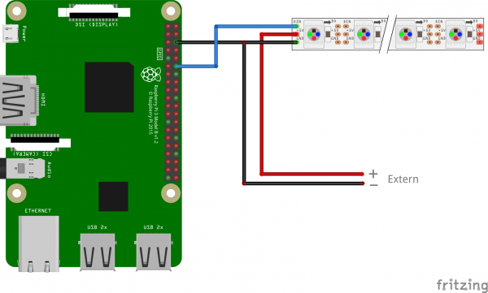

# Usage
LedyPi is a project about LEDs and RasperryPi.
The scope of this project is to have an easy way to implement custom patterns on a led script in Python which can then be controlled trought the ssh or on the android app.

Here's a video tutorial showing how the app works on my strip.

[](http://www.youtube.com/watch?v=k1sSvwABXCE "Tutorial")

# Setup
This project uses four main tools:
1. [DotStar_emulator](https://github.com/chrisrossx/DotStar_Emulator) to simulate the led strip.
2. [AppInventor](http://appinventor.mit.edu/) for the android app.
3. [Firebase](https://console.firebase.google.com/) to allow communication between android and pc/raspberry.
4. [rpi-ws281x](https://github.com/rpi-ws281x/rpi-ws281x-python) to control the leds on the raspberry.

Since the _DotStar_emulator_ cannot be installed on the raspberry and the _rpi-ws281x_ does not work on pc, this two libraries are kept well separated.

In the following I will guide you to the installation and setup required to make everything work

## Python 3.7
The project works with python>=3.7, to setup your environment follow the steps:
- (Optional) source your environment, 
- Install the required modules:
    - On pc run `pip install -r requirements.txt `
    - On rpi run `pip3 install -r requirements_pi.txt `
- To debug install [DotStar_emulator repo](https://github.com/chrisrossx/DotStar_Emulator) on pc with:
```
python DotStar_Emulator/setup.py install
```

## App Inventor
The MIT [AppInventor](http://appinventor.mit.edu/) is a tool to simply create apps with a building block programming paradigm. 
The first thing you'll need to do is make an account.
Then you can import the app from the [ledypie.aia](AppInventor/ledypie.aia) file:
```
Click on 'Create Apps!'
Login
Click on 'My Projects' on the top left 
Import project (.aia) from my computer ...
And select the ledypie.aia file
```
You can check the [README](AppInventor/README.md) in the AppInventor directory for a detailed explanation of the app.

### Firebase
The communication between the app and python is done through the [Firebase](https://console.firebase.google.com/) database.

#### Database creation and linking 
To create a Firebase database and link it to the app use [this tutorial](https://rominirani.com/tutorial-mit-app-inventor-firebase-4be95051c325).
Be aware that the FireBaseDB is already present in the app so you don't need to instantiate a new one, simply fill out the _FirebaseToken_ and _FirebaseURL_

#### Generating private key file
To connect the database with the python application you will need to generate a private key file as follows
```
In the Firebase console, open Settings > Service Accounts.

Click Generate New Private Key, then confirm by clicking Generate Key.
```
This will create a _privatekey.json_ file which will be used later.

## Raspberry Diagram
Im currently using a _Raspberry Pi 4 Model B Rev 1.2_ with a [ws2812b led strip](https://www.amazon.com/CHINLY-Individually-Addressable-Waterproof-waterproof/dp/B01LSF4Q0A/ref=sr_1_7?dchild=1&keywords=ws2812b&qid=1593792574&sr=8-7) counting 300 leds on 5 meters.

Since the ws2812b draws 60mA for each led with 5V (check the [specs](https://cdn-shop.adafruit.com/datasheets/WS2812B.pdf)) I am powering the led strip using a [5v 100W power supply](https://www.amazon.com/BTF-LIGHTING-Aluminum-WS2812B-LED8806-Modules/dp/B01D8FLWGE/ref=sr_1_13?dchild=1&keywords=5v+20A+power+supply&qid=1593792785&sr=8-13) which should allow each pixel full brightness.

For the connection you can follow [this tutorial](https://tutorials-raspberrypi.com/connect-control-raspberry-pi-ws2812-rgb-led-strips/)  which uses following diagram:


Since there is no connection powering the RaspberryPi, an usb type c power supply is necessary.

# Testing
If you get a `ModuleNotFoundError` try to set the python path as follows in your terminal window:
```shell script
export PYTHONPATH=./src   
```
Both the local and remote test relies on two processes to work, one of which is always the [gui](./src/pc/main_gui.py).

### Local PC
To test first run the [gui](./src/pc/main_gui.py) and then in a separate process run [patterns](./src/pc/test.py)
```shell script
python src/pc/main_gui.py
python src/pc/test.py
```

### Local RPI
If you wish to run a local test of the rapsberrypi you don't need the gui process, simply ssh into the rpi and execute the test

```shell script
python src/rpi/test.py
```

### Remote 

You can test the remote configuration running the [connect](src/firebase/connect.py) script which takes as **mandatory** inputs 
the credential json file and the mode (either 'pc' or 'rpi') which specify where the script is being run.

An example might be
```shell script
python src/main_gui.py
python src/firebase/connect.py credential.json pc
```
To run the remote app on your pc together with the gui, or 

```shell script
python src/firebase/connect.py credential.json rpi
```
To run it on the raspberrypi.

#### Additional params
The [connect script](src/firebase/connect.py)  accepts two optional arguments:
- _databaseURL_ : the url of your database (default [value](https://ledypie.firebaseio.com/), more in the [firebase tutorial](https://rominirani.com/tutorial-mit-app-inventor-firebase-4be95051c325)
- _pixels_ : the number of pixels (default 300).

To connect to a custom databaseURL with 64 leds on the rpi you should run

```shell script
python src/firebase/connect.py credential.json rpi --databaseURL https://customURL.firebaseio.com/ --pixels 64
```