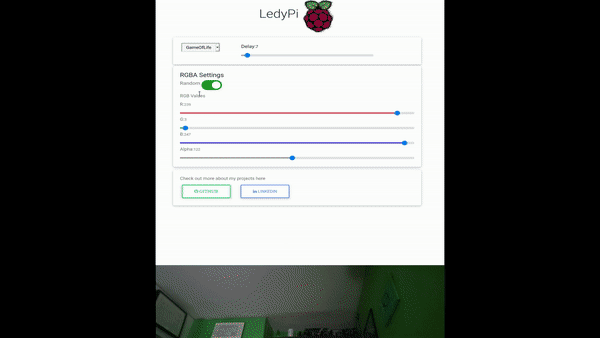

<h1 align="center">
  <br>
    </a>
  <br>
  Ledypi
</h1>

<h4 align="center">Control you led strip with  RaspberryPi, Python and Android</a>.</h4>

<p align="center">
  <a href="https://www.python.org/">
    
  </a>
  <a href="https://forthebadge.com/images/badges/built-with-love.svg">
      
  </a>

</p>

<p align="center">
  <a href="#key-features">Key Features</a> •
  <a href="#Patterns">Patterns</a> •
  <a href="#Installation">Installation</a> •
  <a href="#Testing">Testing</a> •
  <a href="#Contributing">Contributing</a>
</p>

<h4 align="center">
  Click video for tutorial 
</h4>

<p align="center" 
    href="https://youtu.be/c0NvfBiJOkw">
    
</p>


<br>
<br>


# Key Features
Choose from more than 10 pre-made patterns and implement your own.
The modular desing allows you to add the logic you wish by overriding a single method, then you can choose the pattern either trough ssh or on the android app.

- 14 pre-made patterns
- Customizable attributes for each one
- [Music reactive](#music-reactive-click-gif-for-video) 
- [Android app](AppInventor) for control 
- Firebase database
- Debug mode available 

On [develop branch](https://github.com/nicofirst1/ledypi/tree/develop):
- [LedyWeb](https://github.com/nicofirst1/ledyweb) online controller 
- Dynamic android app

# Patterns
Each pattern inherits from a [base class](src/patterns/default.py) with its own logic. This allows anyone to implement his own pattern simply by overriding a method (see more on the [readme](patterns/README.md)).

Moreover each pattern can be customized by changing the values of its attributes, more ahead.

## Fixed logic
There are more than 10 _standard_ pattern to choose from with a steady logic, that is a fixed behavior.

<h3 >Water</h3>

Bring the ocean home with the ocean pattern. You can choose the deepness with the parameters


<h3 >Fire</h3>

If you're cold then try the fire pattern.


<h3 >Game of Life</h3>

Watch how life evolves with the famous [game of life](https://en.wikipedia.org/wiki/Conway%27s_Game_of_Life) algorithm.


## Interactive
On top of these fixed patters there are two interactive patters whose behavior can completely change based on the user input"

### Music Reactive (click gif for video)
[](https://youtu.be/7PXDBr3uZmA) 

This pattern uses a microphone to visualize the music on your led strip. There are three different type of visualization:
- Spectrum: split the strip on subsequent frequency bands and visualize the amplitude as a mix of rgb values
- Energy: use an energy function to plot the sound on the leds
- Scroll: record the audio amplitude on a scrolling timeline.

### Equation
You can input a custom equation for the rgb values. Such equation can depend on:
- time: a time-step is kept so to evolve the function through time
- index: the position of the led-strip can also be used

For example the following patters is given with:
- red = _cos(t)_
- green = _sin(t)_
- blue = _idx_


# Installation 
For the installation check out the related [INSTALL markdown/](markdowns/INSTALL.md).

# Running 
Once you have installed the project on the RaspberryPi you can start it with the [start script](scripts):
```shell script
bash ledypi/scripts/app.sh start
```

For the web controller run it with ( more options are available in the ledyweb [README](ledyweb/README.md)):
```shell script
python manage.py start
```

For testing see the [USAGE file](markdowns/USAGE.md)

# Contributing
If you wish to support this project just fork it and add your pattern following the [readme](src/patterns/README.md).

<a href="https://paypal.me/dizzi17">
  
</a>
&nbsp;&nbsp
<a href="https://www.linkedin.com/in/nicol%C3%B2-brandizzi-04091b153/">
  
</a>